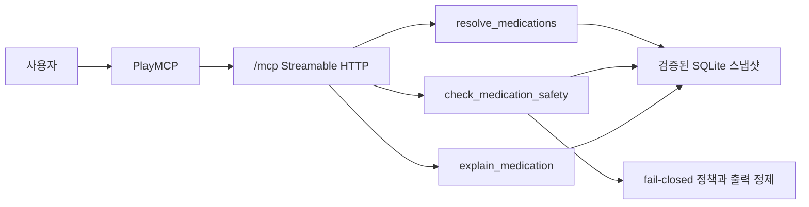

# 설계 개요

## 목표와 비목표

`medsafe-bot`은 사용자가 말한 약 이름을 실제 의약품 품목으로 확인한 뒤, 확인된 조합의 병용금기와 중복성분을 보수적으로 점검하는 read-only remote MCP 서버다. 진단, 처방, 복용·중단·용량 변경 지시는 하지 않는다. OCR, 알약 사진 식별, 리마인더, 서버 푸시는 현재 범위가 아니다.

## 실행 구조

공공 API는 데이터 생성 단계에서만 호출한다. 배포 런타임은 단일 SQLite를 읽으므로 외부 API 지연이 MCP p99에 유입되지 않는다. data model v3의 완전한 DUR 성분 규칙 카탈로그와 완전 파싱된 제품 성분이 있으면 품목 스냅샷 없이도 검사한다. 성분 파싱·규칙 조건·카탈로그가 불완전하고 보완할 품목 스냅샷도 없을 때만 `UNCERTAIN`으로 닫는다.

## 주요 안전 경계

- 정확한 제품명·용량·제형이 아니면 후보를 반환하고 임의 확정하지 않는다.
- 확정 결과만 10분 만료 v2 HMAC token을 발급한다.
- token은 canonical 매핑 변조를 막으며 사용자 선택 자체를 증명한다고 주장하지 않는다.
- 제품의 복합성분 파싱 완전성을 저장하고, 완전한 경우에만 중복성분을 정규화 이름·HIRA 코드 동치 집합으로 비교한다.
- DUR 단일/복합·복합제·관계성분 조건을 보존하며 확인할 수 없는 조건은 RED로 과잉 일반화하지 않고 보류한다.
- `USJNT_TABOO`, `DUP_INGREDIENT`, `DUP_INPUT`만 현재 완료한 핵심 검사로 표시한다.
- 연령별·임부 DUR은 미구현이므로 관련 컨텍스트가 있거나 없으면 명시적으로 보류한다.
- 응급 표현은 약 이름 확인보다 119/응급실 안내를 우선한다.

## 완료 기준

- stateless Streamable HTTP에서 read-only 도구 3개가 동작한다.
- `/readyz`가 빌드 ID, DB SHA-256, 세대 ID, 수집 시각, 데이터 건수와 커버리지를 공개한다.
- 원격 SDK·공식 Inspector 검증이 대표 RED·중복성분·설명·품목 스냅샷 없는 성분 카탈로그 전용 RED·표기 변형과 브랜드 응급 false-green 회귀·비응급 대조군·모호한 과량복용 보류·성분 누락 fail-closed 및 고정 안전 프로브 216개와 대표 흐름 합계 100회 도구별 분포·동시 burst·cold 연결 성능 기준을 통과한다.
- 원문 handoff prompt의 SHA-256이 보존된다.
