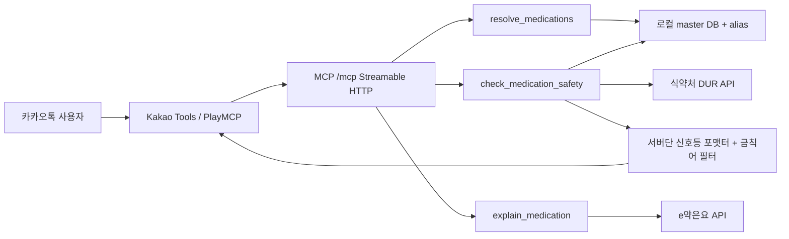

# 설계 개요

## 목표

카카오 AGENTIC PLAYER 출품용 복약안전 remote MCP 서버 MVP를 만든다. 일반 카톡 사용자가 입력한 약 이름을 표준 코드 후보로 정규화하고, 확인된 약 목록에 대해 병용금기와 중복성분을 우선 점검한 뒤 신호등 요약을 반환한다.

## 비목표

- 진단, 처방, 복약 중단/변경 지시를 하지 않는다.
- 예선 MVP에서는 OCR, 사진 자동식별, 리마인더, 세션 기반 푸시를 구현하지 않는다.
- 공식 Swagger나 실데이터로 확정하지 못한 DUR 필드/operation은 코드 전역에 하드코딩하지 않는다.

## SDK 선택

TypeScript `@modelcontextprotocol/sdk`를 선택한다.

- 공식 SDK가 Streamable HTTP와 tool 등록 API를 제공한다.
- JSON Schema/Zod 기반 계약을 타입체크와 함께 관리하기 좋다.
- 카카오 PlayMCP 등록 대상인 remote MCP 서버와 맞는 HTTP 배포 모델을 바로 검증할 수 있다.

## 아키텍처

서버는 stateless 요청-응답 tool만 제공한다. 복약 리마인더나 서버발 푸시는 MCP tool 범위에서 제외한다.

## 약끼리 대비 하는 것 / 안 하는 것

| 구분 | 하는 것 | 안 하는 것 |
|---|---|---|
| 카톡 대리 확인 | 자녀가 부모 약을 대신 입력하는 `context.subjectIsUser=false` 흐름 | 사용자 본인 전용 복약관리 앱으로 고정하지 않음 |
| 대화형 정규화 | 모호하면 후보를 반환하고 확인을 요구 | 후보를 임의 선택하지 않음 |
| 안전 표현 | 신호등, 근거, 출처, 기준일, 디스클레이머를 서버가 강제 | "안전합니다" 같은 단정 생성 금지 |
| 오케스트레이션 | 로컬 매핑, DUR, e약은요를 분리해 교차 조회 | 단일 웹 검색이나 LLM 추론으로 판정하지 않음 |
| MVP 입력 | 텍스트 제품명/성분명 | OCR/이미지 자동식별 제외 |

## 공식 확인 결과

- MCP TypeScript SDK 공식 문서는 서버 구축 절차를 `McpServer` 생성, transport 생성, 연결 순서로 설명하며 Streamable HTTP를 remote 서버용 transport로 제시한다.
- MCP transport 공식 스펙은 Streamable HTTP가 단일 MCP endpoint에서 POST/GET을 지원해야 하며, 로컬 서버는 Origin/Host 검증을 해야 한다고 설명한다.
- 식약처 DUR 품목정보 공공데이터 페이지는 병용금기, 연령금기, 임부금기, 용량주의, 투여기간주의, 노인주의, 효능군 중복주의, 서방정분할주의, DUR 품목조회 제공을 명시한다.
- e약은요 공공데이터 페이지는 일반의약품 중 공급실적 있는 제품의 업체명, 제품명, 품목기준코드, 효능, 사용법, 주의사항, 상호작용, 부작용, 보관법 제공을 명시한다.
- 건강보험심사평가원 ATC 매핑 목록 페이지는 ATC코드와 주성분코드 설명, 전체 21,953행, 파일 다운로드 제공을 명시한다.
- 카카오 AGENTIC PLAYER 10 공식 페이지는 예선 접수 2026-06-15부터 2026-07-14까지, 발표 2026-07-30, 본선 개발 2026-07-30부터 2026-08-27까지, 공개투표 2026-08-31부터 2026-09-28까지, 시상식 2026-10-23을 안내한다.

## 완료 기준

- MCP 서버가 `/mcp`에서 기동한다.
- 세 tool이 `readOnlyHint=true`로 등록된다.
- 매핑 실패, API 실패, 페이지 불완전, 필드 미해결은 모두 녹색이 아닌 노란색으로 강등된다.
- 테스트에서 병용금기 fixture, 중복성분, 매핑 모호성, 금칙어, 디스클레이머를 검증한다.
